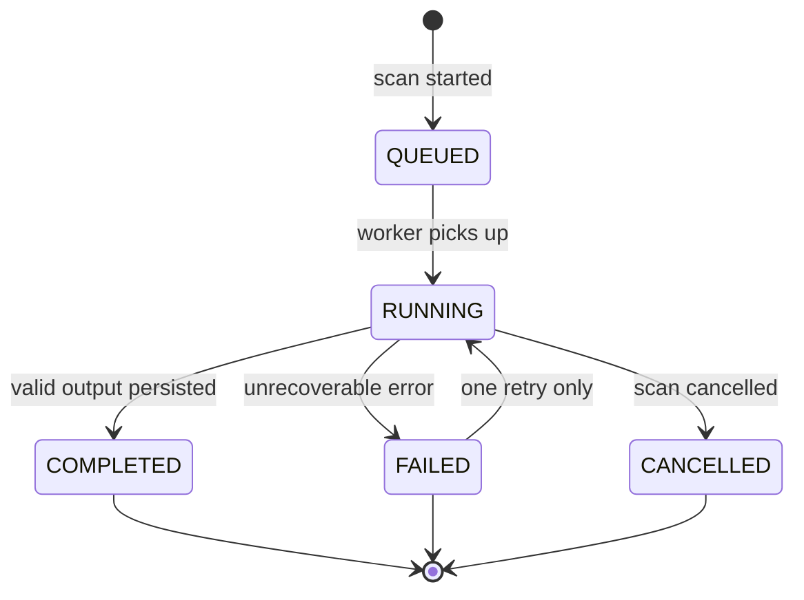

# Warden Agent — Design Specification (MVP)

Aligned with [architecture.md](./architecture.md), [mvp.md](./mvp.md), and [decisions.md](./decisions.md).

**Scope boundary:** The Warden Agent is a **single-shot analysis worker**. It does not approve, execute, or write to GitLab. Steps 6–7 in the product flow (wait for approval, create issue) belong to the **orchestrator + executor** after the agent returns.

```text
┌─────────────────────────────────────────────────────────────┐
│  WARDEN AGENT (this document)                                │
│  Input: one repo snapshot + MCP context + static signals     │
│  Output: findings[] + proposedActions[] (max 3)              │
└─────────────────────────────────────────────────────────────┘
                              ↓
┌─────────────────────────────────────────────────────────────┐
│  ORCHESTRATOR + UI + EXECUTOR (not the agent)                │
│  Wait for approval → REST create_issue                       │
└─────────────────────────────────────────────────────────────┘
```

---

## 1. Agent lifecycle

### Macro lifecycle (one scan)

```text
TRIGGERED
  → CONTEXT_READY      (orchestrator: MCP + static, no LLM)
  → ANALYSIS_RUNNING   (agent: one Gemini session)
  → ANALYSIS_COMPLETE  (validated JSON)
  → PERSISTED          (orchestrator writes DB)
  → [AGENT IDLE]

--- human time ---

APPROVED             (user, not agent)
  → EXECUTING          (executor, not agent)
  → EXECUTED | FAILED
```

### What the agent owns vs orchestrator

| Phase | Owner | Agent involved? |
|--------|--------|-----------------|
| Enqueue scan | Orchestrator | No |
| MCP read + static rules | Orchestrator | No (agent receives results as **facts**) |
| Analyze + prioritize + propose | **Warden Agent** | Yes (1–2 LLM calls max) |
| Validate JSON | Orchestrator | No |
| Persist findings/proposals | Orchestrator | No |
| User approval | UI / API | No |
| Create GitLab issue | Executor + REST | **Never** |

### Agent session model

- **One repository** per invocation.
- **No memory** of prior scans (orchestrator may pass `previousScanSummary` as read-only text; agent must not assume it’s true without evidence in current context).
- **Stateless:** all state is input JSON + output JSON; `scanId` / `agentRunId` are correlation IDs only.
- **Timeout:** 90s hard cap on LLM work; orchestrator kills session and falls back to static-only findings.

### Agent run types (MVP)

| Run type | When | LLM? |
|----------|------|------|
| `FULL_ANALYSIS` | Normal scan | Yes |
| `SKIPPED` | MCP/context failure with static findings ≥3 | No |
| `RETRY` | Malformed JSON once | Yes (second attempt, trimmed context) |

No other run types in MVP.

---

## 2. Agent state machine

### `AgentRun` states (DB-aligned)



### Internal phases within `RUNNING` (logical, log via `AgentAction`)

```text
RUNNING
  ├─ LOAD_INPUT          (read bundled context from orchestrator)
  ├─ REASON              (Gemini: map signals → findings)
  ├─ PRIORITIZE          (rules + optional LLM reorder)
  ├─ PROPOSE             (Gemini or same call: ≤3 actions)
  ├─ VALIDATE_OUTPUT     (orchestrator Zod, not LLM)
  └─ EMIT                (return JSON to orchestrator)
```

### `Scan` interaction (orchestrator-level)

```text
Scan.QUEUED → Scan.RUNNING
  → [AgentRun COMPLETED] → Scan.COMPLETED
  → [AgentRun FAILED + static fallback OK] → Scan.COMPLETED (degraded)
  → [AgentRun FAILED + no fallback] → Scan.FAILED
```

### Hard rules (state guards)

| Transition | Guard |
|------------|--------|
| `PROPOSE` → persist | `findings.length ≤ 12`, `proposedActions.length ≤ 3` |
| Executor `create_issue` | `ProposedAction.status === APPROVED` **and** `Approval` exists — agent never sets this |
| Agent `RUNNING` → `COMPLETED` | Output passes schema + every `evidenceRef` resolves to input fact |
| Retry | `attempt === 1` only |

---

## 3. Tool definitions

MVP uses a **hybrid tool model**: orchestrator tools (deterministic) + MCP owned by orchestrator (not the LLM loop).

### 3.1 Orchestrator tools (run before agent; agent does NOT call these)

| Tool ID | Input | Output | Used for category |
|---------|--------|--------|-------------------|
| `static.scan_file_tree` | `repoPath`, `maxFiles=200` | File list + line counts | MISSING_TESTS, MAINTAINABILITY |
| `static.detect_missing_tests` | file tree | `{ sourceFile, expectedTestPath }[]` | MISSING_TESTS |
| `static.detect_large_files` | file tree, `threshold=400` | `{ path, lines }[]` | MAINTAINABILITY |
| `static.count_todo_markers` | file tree, sample files | `{ path, count }[]` | TECHNICAL_DEBT |
| `gitlab.get_project` | `projectId` | name, default_branch, web_url | all |
| `gitlab.list_merge_requests` | `projectId`, `state=opened`, `limit=10` | MR list | CI_CD, RISKY_CHANGE |
| `gitlab.get_pipeline` | `projectId`, `ref` or `mrIid` | status, failed_jobs summary | CI_CD |
| `gitlab.list_commits` | `projectId`, `ref=default`, `limit=20` | commits | RISKY_CHANGE |
| `gitlab.get_file` | `projectId`, `path`, `ref` | content (max 500 lines) | TECHNICAL_DEBT (optional) |
| `gitlab.list_issues` | `projectId`, `state=opened`, `limit=5` | counts/labels | proposal context only |

### 3.2 Agent-facing tools (MVP: **none during LLM**)

**Decision:** The orchestrator **pre-fetches** all MCP data and passes a single `AnalysisContext` JSON to Gemini. The agent has **zero live tool calls** in the hot path.

Why:

- Predictable latency and token budget
- Audit log shows MCP calls clearly (orchestrator-owned)
- Prevents runaway tool loops and hallucinated “I called X”

Post-MVP: expose read-only tools with strict allowlist and max 5 invocations per scan.

### 3.3 Executor tools (post-approval; not agent)

| Tool ID | Protocol | Purpose |
|---------|----------|---------|
| `gitlab.create_issue` | REST | Create issue from `ProposedAction.gitlabPayload` |

---

## 4. MCP tool usage strategy

### Principle: MCP is orchestrator-owned, agent-consumed

```text
Cloud Run Orchestrator
  → GitLab MCP (HTTP) × 4–6 calls (sequential)
  → static.* × 2–4 calls
  → build AnalysisContext
  → Agent Builder / Gemini (no MCP in loop)
  → log AgentAction: "context_bundle_built"
```

### P0 MCP calls (every scan, fixed order)

| Order | MCP tool | Max calls | Feeds |
|-------|----------|-----------|--------|
| 1 | Project metadata | 1 | All |
| 2 | List open MRs | 1 | CI_CD, RISKY_CHANGE |
| 3 | Pipeline for default branch | 1 | CI_CD |
| 4 | Recent commits on default | 1 | RISKY_CHANGE |

### P1 MCP calls (conditional)

| Condition | MCP tool | Max |
|-----------|----------|-----|
| Any open MR has failed pipeline | `get_pipeline` per MR | 2 |
| TODO/static flagged files ≤ 3 | `get_file` | 3 |

**Hard cap:** 8 MCP calls per scan.

### What MCP must NOT do in MVP

- `create_issue`, `create_merge_request`, or any write
- Repo-wide `search_code`
- Wiki, releases, milestones

### Audit requirement

Each MCP call → `AgentAction` row:

```json
{
  "type": "TOOL_INVOKED",
  "payload": {
    "tool": "gitlab.list_merge_requests",
    "durationMs": 420,
    "summary": "3 open MRs, 1 failed pipeline"
  }
}
```

Agent output may **reference** these summaries only; it cannot claim tools it didn’t receive in `AnalysisContext.mcpAudit`.

---

## 5. Prompt strategy

### Structure: 3 blocks, 1 completion (MVP)

| Block | Role |
|-------|------|
| **System** | Role, constraints, categories, anti-hallucination rules, JSON-only |
| **User** | `AnalysisContext` JSON (facts) + explicit task |
| **Response** | Structured JSON (Gemini `responseSchema` or JSON mode) |

Optional second call only on retry with error feedback — avoid by default.

### System prompt (content outline)

1. **Identity:** “You are Warden, an engineering manager assistant analyzing **one** GitLab repository.”
2. **Allowed categories:** Enum of 5 only; reject others.
3. **Evidence rule:** Every finding must cite `evidenceRef` keys present in input; no invented paths, SHAs, MR numbers.
4. **Output rule:** Valid JSON matching schema; no markdown, no prose outside JSON.
5. **Caps:** Max 12 findings, max 3 proposed actions.
6. **Prohibited:** security findings, auto-fix code, MR creation, praise/fluff, generic advice without evidence.
7. **Prioritization:** Use provided `priorityScore` formula (§9); you may adjust ±10 with justification in `priorityReason`.

### User prompt (content outline)

```text
Analyze this repository snapshot.

Repository: {pathWithNamespace}
Default branch: {defaultBranch}
Scan correlation: {scanId}

=== FACTS (do not contradict) ===
{AnalysisContext JSON}

=== STATIC SIGNALS (treat as ground truth) ===
{staticSignals JSON}

=== MCP SUMMARY (treat as ground truth) ===
{mcpSummary JSON}

Tasks:
1. Produce findings for categories: MISSING_TESTS, MAINTAINABILITY, TECHNICAL_DEBT, RISKY_CHANGE, CI_CD
2. Assign severity and confidence per finding
3. Compute priorityScore using the formula provided
4. Propose up to 3 GitLab issues (titles + bodies only — do not claim created)

Return JSON only.
```

### Context trimming (token discipline)

| Data | Limit |
|------|--------|
| File tree | 200 paths, depth 6 |
| File content | 3 files × 500 lines |
| MRs | 10 |
| Commits | 20 |
| TODO samples | 10 files |

If over budget: drop `get_file` content first; keep static + MCP summaries.

### Prompt versioning

- Store `promptHash` + `AgentPromptVersion` per run (architecture).
- MVP: single version `warden-mvp-1.0`; change only if demo findings regress.

### Model settings (recommended)

| Parameter | Value | Why |
|-----------|--------|-----|
| Temperature | 0.1–0.2 | Reduce creativity / hallucination |
| Top-p | 0.9 | — |
| Max output tokens | 4096 | Enough for 12 findings + 3 proposals |
| Response format | JSON schema enforced | Fail fast in orchestrator |

---

## 6. Structured JSON outputs

### 6.1 Agent output (root)

```json
{
  "schemaVersion": "1.0",
  "scanId": "string",
  "repositoryId": "string",
  "modelId": "string",
  "findings": [],
  "proposedActions": [],
  "analysisMeta": {
    "categoriesPresent": ["MISSING_TESTS"],
    "findingCount": 8,
    "degraded": false,
    "warnings": []
  }
}
```

Limits: `findings` max 12, `proposedActions` max 3.

### 6.2 `FindingOutput`

```json
{
  "id": "fnd_local_01",
  "category": "MISSING_TESTS",
  "severity": "HIGH",
  "confidence": 0.85,
  "title": "string, max 120 chars",
  "description": "string, max 800 chars",
  "priorityScore": 72,
  "priorityReason": "string, max 200 chars",
  "evidenceRefs": [
    {
      "refId": "static.missing_test.0",
      "type": "file",
      "filePath": "src/foo.ts",
      "startLine": null,
      "endLine": null,
      "commitSha": null,
      "mrIid": null,
      "pipelineId": null
    }
  ],
  "source": "STATIC"
}
```

**Categories:** `MISSING_TESTS` | `MAINTAINABILITY` | `TECHNICAL_DEBT` | `RISKY_CHANGE` | `CI_CD`

**Severity:** `CRITICAL` | `HIGH` | `MEDIUM` | `LOW` | `INFO`

**Source:** `STATIC` | `AGENT` | `HYBRID`

Orchestrator maps `id` → DB `Finding.id` (cuid). Local IDs are for proposal linking only.

### 6.3 `ProposedActionOutput`

```json
{
  "id": "prop_local_01",
  "type": "CREATE_ISSUE",
  "title": "string, max 120",
  "summary": "string, max 1500",
  "priorityScore": 80,
  "linkedFindingIds": ["fnd_local_01"],
  "gitlabIssueTemplate": {
    "title": "string",
    "description": "string",
    "labels": ["warden", "technical-debt"]
  }
}
```

**No** `draftMrPlan`, **no** `branchName`, **no** `patch`.

### 6.4 `AnalysisContext` (orchestrator → agent input, not returned)

```json
{
  "repository": {
    "projectId": 123,
    "pathWithNamespace": "group/repo",
    "defaultBranch": "main",
    "webUrl": "https://gitlab.com/..."
  },
  "staticSignals": {
    "missingTests": [],
    "largeFiles": [],
    "todoMarkers": []
  },
  "mcpSummary": {
    "openMrs": [],
    "defaultBranchPipeline": {},
    "recentCommits": []
  },
  "mcpAudit": []
}
```

Each fact in `staticSignals` / `mcpSummary` must include a stable `refId` (e.g. `static.missing_test.0`, `mcp.mr.0`).

### Validation (orchestrator, Zod)

| Rule | Action on fail |
|------|----------------|
| Schema match | Retry once with error message |
| `category` ∈ allowed 5 | Drop finding or fail scan |
| `evidenceRefs[].refId` exists in input | Drop finding |
| `commitSha` / `mrIid` match input | Drop finding |
| Count limits | Truncate lowest `priorityScore` |
| Duplicate fingerprint | Merge (same category + path + type) |

---

## 7. Failure handling

### Failure taxonomy

| Code | Cause | User-visible | Agent retry? |
|------|--------|--------------|--------------|
| `MCP_UNAVAILABLE` | MCP timeout/401 | “GitLab read degraded” | No — static path |
| `CONTEXT_INCOMPLETE` | <2 MCP calls succeeded | Warning banner | No |
| `AGENT_TIMEOUT` | >90s | “Analysis timed out” | Once |
| `AGENT_INVALID_JSON` | Parse/schema fail | “Retrying analysis…” | Once |
| `AGENT_EMPTY_OUTPUT` | 0 findings | Fall back to static-only | Once |
| `AGENT_OVER_CAP` | >12 findings | Truncate | No retry |
| `SCAN_CANCELLED` | User cancelled | Cancelled | No |

### Degraded success (important for demo)

If agent fails but `staticSignals` produce **≥3 findings**:

- `Scan.status = COMPLETED`
- `analysisMeta.degraded = true`
- Generate **1** rule-based `ProposedAction` from top static finding (orchestrator template, no LLM)
- UI: “AI analysis unavailable — showing rule-based results”

### Retry policy

- **One** retry for `AGENT_INVALID_JSON` or `AGENT_TIMEOUT`
- Retry uses **trimmed** context (no file bodies, MCP summary only)
- No retry for hallucination drops (silent fix)

### Executor failures (post-approval, not agent)

| Code | Handling |
|------|----------|
| `GITLAB_409` | Show error; proposal stays `APPROVED`; idempotency prevents duplicate |
| `GITLAB_422` | Show validation error |
| `GITLAB_429` | Backoff 30s, one retry |

Agent is **not** invoked on executor failure.

---

## 8. Hallucination prevention

### Layer 1 — Architecture

| Control | Effect |
|---------|--------|
| No live tools in agent loop | Can’t invent tool results |
| Facts-only input | LLM is interpreter, not discoverer |
| Static signals for tests/large files | Ground truth for 2 categories |
| Executor separate | Can’t claim issue created |

### Layer 2 — Prompt

- “If not in FACTS, do not assert it.”
- “Do not invent file paths, MR IID, commit SHAs, or pipeline IDs.”
- “Use `refId` from input in every `evidenceRef`.”

### Layer 3 — Post-validation (orchestrator)

| Check | Drop / fix |
|-------|------------|
| `refId` not in context | Drop finding |
| SHA/IID mismatch | Drop finding |
| Category not in enum | Drop finding |
| Severity without evidence | Drop finding |
| Confidence > 0.9 without static or MCP ref | Cap at 0.85 |
| Duplicate title + path | Merge |

### Layer 4 — Source tagging

| `source` | Meaning |
|----------|---------|
| `STATIC` | Wholly from `staticSignals` |
| `AGENT` | LLM synthesis from MCP/commits (higher scrutiny) |
| `HYBRID` | Static fact + agent narrative |

UI: badge “Verified by rules” on `STATIC`.

### Layer 5 — Category-specific guards

| Category | Must have |
|----------|-----------|
| MISSING_TESTS | `static.missing_test.*` ref |
| MAINTAINABILITY | `static.large_file.*` or file path in tree |
| TECHNICAL_DEBT | `static.todo.*` or `get_file` ref with TODO line numbers |
| RISKY_CHANGE | `mcp.commit.*` or `mcp.mr.*` ref |
| CI_CD | `mcp.pipeline.*` or MR with failed pipeline in input |

If guard fails → drop finding.

### Out of scope for MVP

- RAG over entire repo
- Agent self-critique / second LLM judge
- Security CVE lookup

---

## 9. Priority scoring system

**Hybrid:** deterministic base score (orchestrator computable) + small LLM adjustment (±10, optional).

### Base score (0–100)

```text
priorityScore = clamp(0, 100,
  severityWeight
  + categoryBoost
  + evidenceBoost
  + recencyBoost
  + confidenceFactor
)
```

| Component | Values |
|-------------|--------|
| `severityWeight` | CRITICAL=50, HIGH=35, MEDIUM=20, LOW=10, INFO=5 |
| `categoryBoost` | CI_CD=+15, RISKY_CHANGE=+12, MISSING_TESTS=+8, MAINTAINABILITY=+6, TECHNICAL_DEBT=+4 |
| `evidenceBoost` | STATIC=+10, MCP=+8, AGENT-only=+0 |
| `recencyBoost` | commit/MR in last 7d: +10; 8–30d: +5; else 0 |
| `confidenceFactor` | `round(confidence * 10)` |

### Proposal score

```text
proposal.priorityScore = max(linked findings' priorityScore) + 5
```

### Sort orders

- Findings list: `priorityScore DESC`, then `severity`, then `category`
- Proposal inbox: `priorityScore DESC`

### Truncation when >12 findings

Keep top 12 by `priorityScore`; drop INFO first.

### LLM adjustment (optional)

- Allowed: ±10 with `priorityReason` citing fact refs
- Orchestrator clamps final score to 0–100

### Severity rubric (agent guidance)

| Signal | Severity |
|--------|----------|
| CI_CD pipeline failed on default | HIGH |
| CI_CD failed on open MR | MEDIUM |
| RISKY_CHANGE direct push to default | HIGH |
| MISSING_TESTS on core `src/` | MEDIUM |
| MAINTAINABILITY >800 lines | HIGH; 400–800 | MEDIUM |
| TECHNICAL_DEBT todos >20 in one file | MEDIUM |

---

## 10. Exact reasoning flow

End-to-end, single scan, ruthlessly linear.

```text
═══════════════════════════════════════════════════════════════
PHASE 0 — TRIGGER (Orchestrator, t=0)
═══════════════════════════════════════════════════════════════
User clicks "Run scan"
  → INSERT Scan(status=QUEUED)
  → INSERT AgentRun(status=QUEUED, attempt=1)
  → Enqueue Cloud Run job
  → ActivityEvent(SCAN_STARTED)

═══════════════════════════════════════════════════════════════
PHASE 1 — CONTEXT_GATHER (Orchestrator, no LLM, t=0–30s)
═══════════════════════════════════════════════════════════════
1.1  AgentRun → RUNNING, AgentAction(PHASE_STARTED, CONTEXT_GATHER)
1.2  static.scan_file_tree(repo)
1.3  static.detect_missing_tests → refs static.missing_test.*
1.4  static.detect_large_files(threshold=400) → refs static.large_file.*
1.5  static.count_todo_markers(top 10 files) → refs static.todo.*
1.6  MCP gitlab.get_project
1.7  MCP gitlab.list_merge_requests (open, limit=10)
1.8  MCP gitlab.get_pipeline(default_branch)
1.9  MCP gitlab.list_commits(default, limit=20)
1.10 IF any MR pipeline failed → MCP get_pipeline for that MR (≤2)
1.11 IF todo files ≤ 3 → MCP get_file for those paths
1.12 Build AnalysisContext JSON + mcpAudit array
1.13 AgentAction(TOOL_INVOKED × N), PHASE_COMPLETED CONTEXT_GATHER

IF MCP totally fails:
  → Continue with static only; flag CONTEXT_INCOMPLETE

═══════════════════════════════════════════════════════════════
PHASE 2 — ANALYZE + PRIORITIZE + PROPOSE (Warden Agent, t=30s–120s)
═══════════════════════════════════════════════════════════════
2.1  AgentAction(PHASE_STARTED, ANALYZE)
2.2  Load system prompt v1.0 + user prompt with AnalysisContext
2.3  Gemini single completion (JSON schema enforced)

     INTERNAL REASONING (conceptual steps the model should follow):
     ─────────────────────────────────────────────────────────
     A. Inventory facts by category
        - MISSING_TESTS: list each static.missing_test.*
        - MAINTAINABILITY: list each static.large_file.*
        - TECHNICAL_DEBT: rank static.todo.* by count
        - CI_CD: MRs/pipelines with status failed/skipped
        - RISKY_CHANGE: direct commits to default? large recent commits?

     B. Draft findings (1 per fact cluster, avoid duplicates)
        - Attach evidenceRefs with valid refIds only
        - Assign severity (rubric in §9)
        - Set source STATIC | HYBRID | AGENT

     C. Compute priorityScore per §9 for each finding

     D. Sort findings by priorityScore DESC; cap at 12

     E. Cluster findings into ≤3 proposal themes
        - Example: 3 MISSING_TESTS → one issue "Add tests for api module"
        - Example: failed pipeline MR → one issue "Fix CI on !42"
        - Each proposal: CREATE_ISSUE only, gitlabIssueTemplate filled

     F. Self-check before output
        - Every refId exists?
        - No security category?
        - ≤12 findings, ≤3 proposals?
     ─────────────────────────────────────────────────────────

2.4  AgentAction(PHASE_COMPLETED, ANALYZE)
2.5  AgentAction(PHASE_STARTED, PRIORITIZE)
2.6  AgentAction(PHASE_COMPLETED, PRIORITIZE)
2.7  AgentAction(PHASE_STARTED, PROPOSE)
2.8  AgentAction(PHASE_COMPLETED, PROPOSE)

═══════════════════════════════════════════════════════════════
PHASE 3 — VALIDATE + PERSIST (Orchestrator)
═══════════════════════════════════════════════════════════════
3.1  Zod validate agent JSON
     → on fail: IF attempt=1 → RETRY goto 2.2 (trimmed context)
     → on fail: IF attempt=2 → degraded static path

3.2  For each finding: verify evidence, compute final priorityScore
3.3  INSERT Finding, FindingEvidence (snippetHash only)
3.4  INSERT ProposedAction + links (status=PENDING_APPROVAL)
3.5  AgentRun → COMPLETED
3.6  Scan → COMPLETED
3.7  ActivityEvent(SCAN_COMPLETED)

═══════════════════════════════════════════════════════════════
PHASE 4 — WAIT (Human, not agent, unbounded time)
═══════════════════════════════════════════════════════════════
4.1  User reviews findings + proposals in UI
4.2  User clicks Approve on one ProposedAction
     → INSERT Approval
     → ProposedAction.status = APPROVED
     → ActivityEvent(PROPOSAL_APPROVED)

     OR Reject → status REJECTED, stop

═══════════════════════════════════════════════════════════════
PHASE 5 — EXECUTE (Executor + REST, not agent)
═══════════════════════════════════════════════════════════════
5.1  ProposedAction.status = EXECUTING
5.2  REST POST /projects/:id/issues (idempotency key)
5.3  INSERT IssueCreationRecord
5.4  ProposedAction.status = EXECUTED
5.5  ActivityEvent(ISSUE_CREATED)
5.6  AgentAction(EXECUTION_COMPLETED) // logged by executor, not Gemini

AGENT LIFECYCLE ENDS AT PHASE 3.
```

---

## MVP alignment checklist

| Requirement | Covered |
|-------------|---------|
| Single repo only | Yes — one `AnalysisContext` |
| 5 categories only | Enum + validation |
| Generate findings | Max 12, evidence-bound |
| Prioritize | §9 formula |
| ≤3 proposed actions | `CREATE_ISSUE` only |
| Wait for approval | Phase 4 — outside agent |
| Issue after approval | Phase 5 — REST executor |
| No MR / multi-agent / memory / security / auto-fix / autonomous | Explicitly excluded |

---

## Ruthless cuts (do not add to agent)

- Second agent for “review”
- Conversational follow-up in same session
- Cross-scan “memory”
- User chat with agent in UI
- Code patch generation
- Severity for dependency vulnerabilities
- Autonomous issue creation without `APPROVED`
