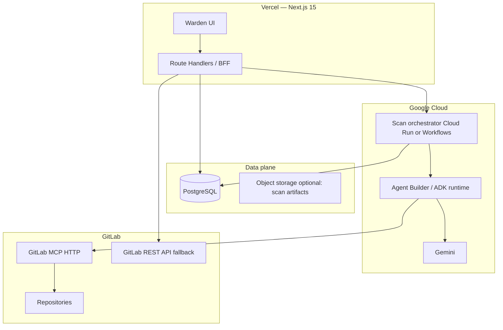
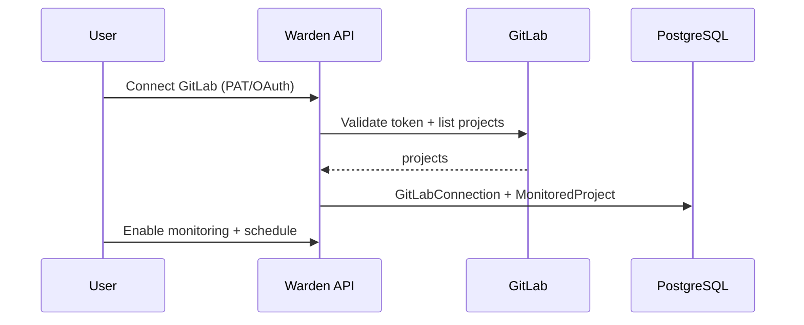
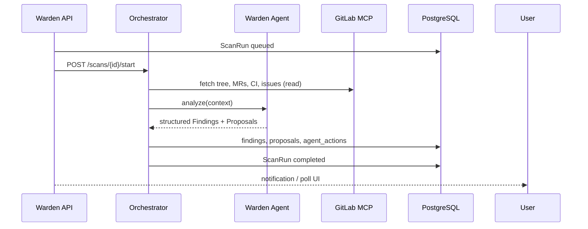
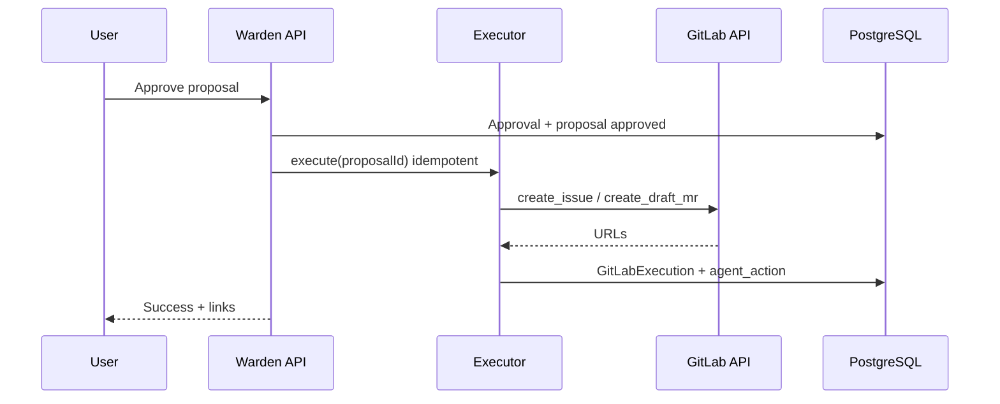

# Warden — Architecture & Critical Review

Greenfield repo; hackathon context points to **Rapid Agent** (DevPost) and **Google Cloud Agent Builder**. Below is a production-minded design tuned for a hackathon demo without implementation code in this document.

---

## Product boundary

**Warden** is an AI-powered autonomous engineering manager that continuously monitors GitLab repositories using GitLab MCP and Gemini through Google Cloud Agent Builder.

| Layer | Name | Role |
|--------|------|------|
| Product | **Warden** | Dashboard, approvals, audit trail, agent persona |
| Agent | **Warden Agent** | Autonomous EM: analyze → propose → act after approval |

The user always remains in control.

---

## 1. High-level architecture



### Core principle: human-in-the-loop command bus

Warden never mutates GitLab directly from the LLM. Flow:

1. **Observe** — read-only via MCP + cached repo snapshot.
2. **Reason** — Gemini produces structured findings.
3. **Propose** — persisted proposals with severity, evidence, suggested patch/issue text.
4. **Approve** — user action in Warden.
5. **Execute** — deterministic workers call GitLab APIs/MCP with scoped tokens.

This maximizes judge trust (“user always in control”) and limits blast radius.

### Agent capabilities

1. Analyze repositories.
2. Detect technical debt.
3. Detect maintainability issues.
4. Detect missing tests.
5. Detect risky code changes.
6. Prioritize findings.
7. Create actionable proposals.
8. Create GitLab issues after approval.
9. Create draft merge requests after approval.
10. Maintain history of all agent actions.

### Critical weaknesses

| Risk | Why it hurts | Mitigation |
|------|----------------|------------|
| **Split runtime** (Vercel + GCP) | Cold starts, auth bridging, harder local dev | Single “scan job” contract; mock agent locally |
| **Agent Builder lock-in** | Docs/API churn; demo fragility | Thin `AgentPort` interface; swap to direct Gemini + tools for MVP fallback |
| **GitLab MCP tier** | Official MCP is **Premium/Ultimate Beta** | Abstract `GitLabPort`; REST fallback for judges on Free tier |
| **Serverless scan duration** | Full-repo analysis > Vercel limits | All heavy work on GCP (Cloud Run Job / Workflow) |
| **LLM non-determinism** | Different findings per run | Version prompts + store `modelId`, `promptHash`, input snapshot hash |

---

## 2. Service boundaries

```text
┌─────────────────────────────────────────────────────────────────┐
│ warden-web (Vercel)                                              │
│  - UI, approvals, audit viewer                                   │
│  - BFF: auth session, CRUD proposals, enqueue scans              │
│  - NO long-running agent loops                                   │
└───────────────────────────┬─────────────────────────────────────┘
                            │ HTTPS + signed internal JWT
┌───────────────────────────▼─────────────────────────────────────┐
│ warden-orchestrator (GCP Cloud Run / Workflows)                    │
│  - Scan lifecycle, retries, idempotency                            │
│  - Fetches repo context, chunks, calls agent                       │
│  - Writes findings + agent_action rows                           │
└───────────────────────────┬─────────────────────────────────────┘
                            │
┌───────────────────────────▼─────────────────────────────────────┐
│ warden-agent (Agent Builder / ADK)                               │
│  - Tool use: GitLab MCP (read), static analyzers (optional)        │
│  - Structured output: Finding[], Proposal[]                      │
│  - Stateless per scan; state in DB                                 │
└───────────────────────────┬─────────────────────────────────────┘
                            │
┌───────────────────────────▼─────────────────────────────────────┐
│ warden-executor (GCP Cloud Run, separate service)                  │
│  - ONLY runs after approval                                        │
│  - create_issue, create_draft_mr (idempotent)                    │
│  - Uses user-delegated OAuth/PAT, not agent credentials          │
└─────────────────────────────────────────────────────────────────┘

┌─────────────────────────────────────────────────────────────────┐
│ gitlab-mcp-adapter (sidecar or managed HTTP)                     │
│  - Normalizes tools → internal GitLabCommand enum                │
│  - Enforces read-only during analyze phase                       │
└─────────────────────────────────────────────────────────────────┘
```

**Do not** let the Next.js route handler host MCP stdio or 10-minute agent loops.

**Boundary rule:** UI talks only to `warden-web` API. Agent never talks to browser. Executor never calls Gemini.

---

## 3. Database architecture (PostgreSQL + Prisma)

### Entity groups

**Tenancy & connections**

- `Workspace` — hackathon: single default workspace OK.
- `GitLabConnection` — instance URL, encrypted token ref, scopes, `lastValidatedAt`.
- `MonitoredProject` — `projectId`, default branch, scan cadence, settings JSON.

**Scan pipeline**

- `ScanRun` — status machine: `queued | running | completed | failed | cancelled`.
- `ScanArtifact` — blob refs (tree snapshot, diff, coverage report path).
- `Finding` — normalized issue from agent + optional rule engine.
- `FindingEvidence` — file, line range, snippet hash, commit SHA, diff hunk.

**Human gate**

- `Proposal` — links 1..n findings, `priorityScore`, `status: draft | pending_approval | approved | rejected | executed | failed`.
- `Approval` — `userId`, `decision`, `comment`, timestamp (immutable).

**Execution & audit**

- `AgentAction` — append-only: `type`, `payload`, `correlationId`, `scanRunId`, `proposalId`.
- `GitLabExecution` — issue IID, MR IID, URLs, idempotency key.
- `AgentPromptVersion` — prompt text hash for reproducibility.

### Indexing (production-minded)

- `(monitoredProjectId, createdAt DESC)` on `ScanRun`, `Finding`.
- `(proposalId, status)` partial index for approval queue.
- `idempotencyKey` UNIQUE on `GitLabExecution`.

### Critical weaknesses

- **Storing code snippets** — PII/license risk. Store hashes + line pointers; fetch snippet on demand from GitLab.
- **Prisma on serverless** — connection pooling (Neon/Supabase pooler or Prisma Accelerate).
- **JSON blobs for findings** — hard to query. Use typed columns for `severity`, `category`, `confidence`; JSON only for extras.

### Auth note

Better Auth only if multi-user demo or OAuth to GitLab per user. For hackathon MVP: **single-tenant + API key to Warden + GitLab PAT in GCP Secret Manager** is enough; add Better Auth in v2 if judges ask “multi-team SaaS.”

---

## 4. Event flow diagrams

### 4.1 Repository onboarding



### 4.2 Scan & analyze (read-only)



### 4.3 Approve & execute



### 4.4 Failure / retry

- Orchestrator: exponential backoff, max 3, dead-letter `ScanRun.failed` with `errorCode`.
- Executor: GitLab 409/422 → mark `failed`, do not auto-retry without user.

---

## 5. Agent lifecycle

```text
IDLE → TRIGGERED → CONTEXT_GATHER → ANALYZE → PRIORITIZE → PROPOSE → PERSIST → IDLE
                                                              ↓
                                                    (user) APPROVE → EXECUTE → AUDIT → IDLE
                                                              ↓
                                                    (user) REJECT → AUDIT → IDLE
```

### Phases (implement as explicit state machine)

| Phase | Owner | Output |
|--------|--------|--------|
| `CONTEXT_GATHER` | Orchestrator | Repo metadata, default branch, recent MRs, pipeline status, file tree (bounded) |
| `ANALYZE` | Warden Agent + Gemini | Raw findings with evidence |
| `PRIORITIZE` | Agent or rules | `priorityScore` = f(severity, churn, coverage gap, main-branch risk) |
| `PROPOSE` | Agent | Title, description, labels, suggested MR branch name (not created yet) |
| `PERSIST` | Orchestrator | DB rows + `AgentAction` |
| `EXECUTE` | Executor | GitLab mutations |

### Context budget strategy

1. **Tier 0:** GitLab MCP — project stats, open MRs, failed pipelines, issue labels.
2. **Tier 1:** Diff since last scan SHA.
3. **Tier 2:** Static signals (no LLM): missing test patterns, large files, TODO density — cheap wins for judges.
4. **Tier 3:** LLM on top-N risky files only.

**Weakness:** Unbounded repo → token blowups. Hard cap files + lines; summarize directory tree.

### Structured output contract

Force JSON schema from Gemini:

- `findings[]`: `{ category, severity, confidence, title, description, evidenceRefs[] }`
- `proposals[]`: `{ findingIds[], recommendedAction, gitlabIssueTemplate, draftMrPlan }`

Validate with Zod in orchestrator; reject malformed agent output (retry once, then fail scan).

---

## 6. GitLab MCP integration strategy

### Recommended approach: adapter layer, not raw MCP in UI

```text
Warden Agent
    → GitLabToolAdapter (your code)
        → Official GitLab MCP (HTTP) OR @zereight/mcp-gitlab OR REST
```

### Tool policy matrix

| Phase | MCP tools allowed |
|--------|-------------------|
| Analyze | `get_project`, `list_merge_requests`, `get_file`, `list_commits`, `get_pipeline`, `search_code` (read) |
| Execute | **Disable MCP**; use Executor + REST with narrow scopes (`api`, `write_repository` only when needed) |

### Transport

- **Hackathon:** HTTP MCP to GitLab.com (`docs.gitlab.com` MCP server) with OAuth/PAT.
- **Self-hosted judges:** Env `GITLAB_BASE_URL` + community MCP server.

### Fallback plan (judge-critical)

If MCP unavailable (Free tier, beta outage):

- Implement `GitLabRestAdapter` with same `GitLabPort` interface (projects, repository files, MRs, issues, pipelines).

Demo script: “MCP when available; REST ensures reliability.”

### Weaknesses

- MCP tool surface is huge → agent may call wrong tool. **Allowlist** per phase.
- Latency stacking (agent → MCP → GitLab). Cache project metadata 5–15 min.
- **Credential scope:** never pass user PAT into Agent Builder logs; inject at adapter runtime from Secret Manager.

---

## 7. Security architecture

```text
Trust zones:
  [Browser] — untrusted
  [Vercel BFF] — authenticated session, CSRF on mutations
  [GCP services] — service account, no public agent endpoints
  [GitLab] — per-connection least-privilege tokens
```

| Control | Implementation |
|---------|----------------|
| Secrets | GCP Secret Manager; Vercel env only for `WARDEN_INTERNAL_KEY` |
| Token storage | Encrypt `GitLabConnection` token at rest (KMS or pgcrypto); never log |
| Service-to-service | Signed JWT (`iss=warden-web`, short TTL) for orchestrator/executor |
| Agent sandbox | No arbitrary shell; tool allowlist only |
| Approval gate | Executor checks `proposal.status === approved` + `Approval` row exists |
| SSRF | GitLab base URL allowlist per connection |
| Audit | Append-only `AgentAction`; no UPDATE/DELETE |
| Content exfil | Redact secrets in snippets (regex for keys); block `.env` content in prompts |

**Skip Better Auth for MVP** if single demo user; use **Vercel password protection** + demo API key. Add OAuth when you need per-user GitLab blame.

**Critical gap:** Draft MR creation can leak code if agent suggests wrong branch. Executor must verify target project ID matches `MonitoredProject`.

---

## 8. Rate limiting strategy

| Layer | Limit | Mechanism |
|--------|--------|-----------|
| Warden API | 60 req/min/IP; 10 scans/hour/project | Upstash Redis or Vercel KV |
| Orchestrator | 2 concurrent scans/workspace | DB advisory lock or queue |
| Gemini | RPM/TPM per GCP quota | Token bucket in orchestrator; queue scans |
| GitLab REST | Respect `RateLimit-*` headers | Centralized client with backoff |
| MCP | Serialize tool calls per scan | Worker pool size = 1 per scan |
| Executor | 5 mutations/min/project | Prevent approval spam |

**Idempotency:** `POST /proposals/:id/execute` with `Idempotency-Key` header → unique `GitLabExecution.idempotencyKey`.

**Hackathon realism:** Show a “scan queued” UI when limited — judges like visible backpressure.

---

## 9. Monitoring strategy

| Signal | Tool | Alert |
|--------|------|--------|
| Scan success rate | Custom metrics → Cloud Monitoring | < 90% over 1h |
| Scan duration p95 | Cloud Run metrics | > 10 min |
| Agent malformed JSON rate | Log-based metric | > 5% |
| GitLab 429 rate | Adapter metric | Spike |
| Approval → execute latency | DB query / dashboard | SLA display in UI |
| Cost | GCP billing + Gemini token counters | Daily budget cap |

**Product-facing monitor page** (high judge value): live scan status, last agent action, GitLab rate limit headroom.

OpenTelemetry: trace `scanRunId` across web → orchestrator → agent → MCP.

---

## 10. Logging strategy

**Structured JSON only.** Fields: `timestamp`, `level`, `service`, `scanRunId`, `proposalId`, `correlationId`, `event`, `durationMs`, `gitlabProjectId` — **never** `token`, `fileContent`.

| Event type | Store | Retention |
|------------|--------|-----------|
| Business audit | `AgentAction` table | indefinite |
| Ops logs | Cloud Logging | 30 days |
| Agent reasoning | Optional `AgentTrace` (truncated) | 7 days, opt-in |
| PII | Avoid logging user emails; use internal IDs |

Log levels: `INFO` lifecycle, `WARN` rate limits/retries, `ERROR` failures with `errorCode` enum (not stack traces to client).

**Weakness:** Logging full prompts is expensive and risky. Store `promptHash` + link to version table.

---

## 11. Production folder structure

```text
warden/
├── apps/
│   └── web/                          # Next.js 15 App Router
│       ├── app/
│       │   ├── (dashboard)/
│       │   │   ├── projects/
│       │   │   ├── scans/[scanId]/
│       │   │   ├── findings/
│       │   │   ├── proposals/
│       │   │   └── audit/
│       │   └── api/
│       │       ├── gitlab/connect/
│       │       ├── projects/
│       │       ├── scans/
│       │       ├── proposals/[id]/approve|reject|execute/
│       │       └── health/
│       ├── components/               # shadcn + Framer Motion
│       ├── lib/
│       │   ├── api-client/
│       │   ├── auth/                 # optional better-auth
│       │   └── validators/           # zod schemas shared types
│       └── prisma/                   # or packages/db
├── packages/
│   ├── db/                           # Prisma schema + client
│   ├── contracts/                    # DTOs, event types, JSON schemas
│   └── gitlab-port/                  # GitLabPort + REST + MCP adapters
├── services/
│   ├── orchestrator/                 # Cloud Run: scan worker
│   ├── executor/                     # Cloud Run: approved mutations
│   └── agent/
│       ├── warden/                   # Agent Builder config, prompts
│       └── tools/                    # Tool definitions → MCP
├── infra/
│   ├── terraform/ or pulumi/         # Cloud Run, secrets, IAM
│   └── vercel.json
├── docs/
│   ├── architecture.md               # this file
│   ├── demo-script.md
│   └── threat-model.md
└── scripts/
    ├── seed-demo.ts
    └── local-dev-compose.yml         # postgres only
```

Monorepo (pnpm workspaces) keeps Zod contracts shared between web and workers.

---

## 12. MVP scope (48–72h realistic)

**Must ship for judges**

1. Connect one GitLab.com project (PAT).
2. Manual “Run scan” (no cron required).
3. Agent produces **≥5 finding categories** with evidence links (file:line).
4. Prioritized proposal list with severity badges.
5. Approve **one** proposal → creates **GitLab issue** (draft MR optional if time).
6. **Audit timeline** UI: every agent step visible.
7. Deployed: Vercel UI + one GCP worker + Gemini via Agent Builder.
8. 3-minute demo video script + README architecture diagram.

**Explicitly out of MVP**

- Multi-workspace SaaS, Better Auth, scheduled scans, email notifications, auto-merge, custom policies per language, bi-directional Slack, self-hosted GitLab, full test generation.

**MVP static helpers (cheap quality)**

- Flag files > 500 lines, no `*.test.*` near `src/`, MR without pipeline, default branch direct pushes — merge with LLM findings.

---

## 13. Nice-to-have scope

- Cron / webhook-triggered scans on push to default branch.
- Draft MR with agent-generated patch (high risk; demo carefully).
- Policy packs (“security”, “maintainability”, “test coverage”).
- Finding deduplication across scans.
- Slack/GitLab comment on approval.
- Comparison view: scan-over-scan debt trend.
- OAuth GitLab connect + Better Auth multi-user.
- Custom severity rules per project.
- Export audit PDF for compliance story.

---

## Tech stack

| Layer | Choice |
|--------|--------|
| Frontend | Next.js 15 App Router, TypeScript, Tailwind, ShadCN UI, Framer Motion |
| Backend | Next.js Route Handlers, TypeScript |
| Database | PostgreSQL, Prisma |
| Authentication | Better Auth only if absolutely necessary |
| Agent | Google Cloud Agent Builder, Gemini |
| Partner integration | GitLab MCP |
| Deployment | Vercel, Google Cloud |

---

## Critical weaknesses summary (honest)

1. **Over-ambitious agent scope** — “detect all technical debt” is unbounded; judges will probe false positives.
2. **GitLab MCP tier/beta** — demo account must be Premium/Ultimate or you need REST fallback.
3. **Dual cloud complexity** — more failure modes than a single-platform hackathon project.
4. **LLM-as-linter** — without static checks, credibility suffers; hybrid is mandatory.
5. **Draft MR safety** — highest security and demo risk; defer past issue creation.
6. **Vercel + long jobs** — architectural mistake if scans run on serverless routes.
7. **Cost opacity** — unbounded Gemini on monorepos burns quota mid-demo.

---

## Maximizing hackathon judging score

Rapid Agent / GCP / GitLab sponsors typically reward **visible integration**, **control**, and **clarity**.

| Tactic | Why judges care |
|--------|------------------|
| **Live “Approve → Issue” click** | Proves human-in-the-loop + real GitLab write |
| **Split-screen demo** | Warden audit log + GitLab issue side-by-side |
| **Architecture slide in README** | One Mermaid diagram; shows Staff-level thinking |
| **Name the GCP pieces** | “Agent Builder + Gemini 2.x + Cloud Run orchestrator” |
| **MCP callout** | Show tool call in audit log (“called `list_merge_requests`”) |
| **Reproducibility** | “Scan #12” deep link; same input → stored prompt version |
| **Fail gracefully** | If agent fails, show partial static findings + clear error |
| **Sponsor checklist in README** | Checkbox section: Gemini ✓ MCP ✓ Vercel ✓ |
| **Threat model paragraph** | Shows maturity; mention token encryption + approval gate |
| **90-second elevator + 3-min demo video** | Many hackathons weight video heavily |
| **Seed repo with intentional debt** | Controlled findings beat random open source |
| **Metrics on dashboard** | “3 high, 5 medium, 1 proposal pending” — instant comprehension |

**Do not optimize for:** feature count, autonomous merges, or “AI replaced your EM” messaging — judges penalize loss of control and unverifiable claims.

---

## Recommended decision log (before coding)

1. **Primary GitLab integration:** Official MCP + REST fallback (non-negotiable for demo reliability).
2. **Scan runtime:** GCP Cloud Run Job only.
3. **MVP mutation:** Issues only; draft MRs phase 2.
4. **Auth:** Secret-backed PAT + Vercel protection for hackathon; Better Auth post-hackathon.
5. **Single monorepo** with shared Zod contracts.

---

## Final verdict

The concept is **strong for hackathons** if you narrow the agent to **bounded, evidenced findings** and a **single glorious approval flow**. The biggest architectural mistake would be running the Warden agent inside Next.js API routes on Vercel with direct MCP stdio — that will fail on timeouts, secrets, and judge Wi‑Fi.
