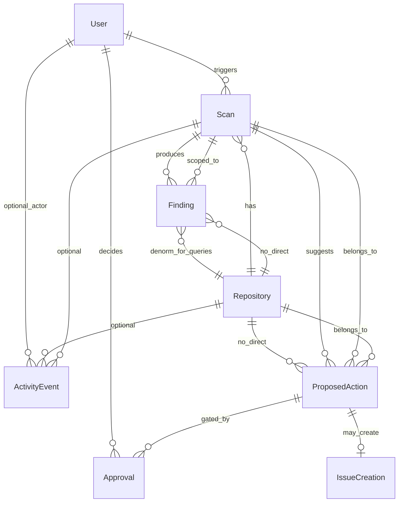

# Minimal Prisma Schema — Hackathon Mode

**Note:** `docs/database-schema.md` is not in the repo yet; this compares against the **production schema** from architecture + the earlier full design (~18 models). Hackathon target: **8 tables**, zero tenancy, findings scoped to `scanId`.

---

## MVP requirement → table mapping

| # | Requirement | Table(s) | Notes |
|---|-------------|----------|--------|
| 1 | One user | `User` | Single seeded row |
| 2 | One repository | `Repository` | GitLab connection fields inlined |
| 3 | Manual scans | `Scan` | Agent/MCP audit folded in |
| 4 | Findings | `Finding` | `scanId` required; evidence as JSON |
| 5 | Proposed actions | `ProposedAction` | `findingIds` as `String[]` |
| 6 | Approvals | `Approval` | Immutable approve/reject |
| 7 | GitLab issue creation | `IssueCreation` | Append-only execution record |
| 8 | Activity feed | `ActivityEvent` | Denormalized feed |

**Total: 8 models.** No workspaces, no agent run tables, no junction tables.

---

## Tables to DELETE from original design

| Removed model | Why unnecessary for hackathon |
|---------------|-------------------------------|
| **`Workspace`** | One user, one repo; no tenant switcher, no billing, no isolation. `repositoryId` is enough scope. |
| **`WorkspaceMember`** | No teams/RBAC; demo user is hardcoded. |
| **`GitLabConnection`** | One PAT, one GitLab.com instance. Put `gitlabInstance`, `tokenSecretRef`, `tokenHint` on `Repository`. |
| **`ScanArtifact`** | No GCS in MVP (`mvp.md`). Store small `contextSnapshot` / `mcpAudit` JSON on `Scan`. |
| **`AgentPromptVersion`** | Single prompt `warden-mvp-1.0`; store `promptVersion` string on `Scan`. |
| **`AgentRun`** | One agent invocation per scan. Use `Scan.status` + `Scan.agentStatus` + `Scan.agentError` instead of a child lifecycle table. |
| **`AgentAction`** | Audit for judges = `ActivityEvent` (`AGENT_TOOL_CALLED`, `SCAN_*`) + `Scan.mcpAudit` JSON. No separate append-only tool log table. |
| **`FindingEvidence`** | Max ~12 findings × 1–2 refs each. `Finding.evidence` JSON array is enough. |
| **`ScanFinding`** | No cross-scan dedup/trends in MVP. `Finding.scanId` is the only link. |
| **`ProposedActionFinding`** | Max 3 proposals × few findings. `ProposedAction.findingIds String[]` avoids a join table. |
| **`MergeRequestCreationRecord`** | Explicitly cut in `decisions.md` / `mvp.md`. |
| **`RepositoryHealthScore`** | Fake “72/100” in UI or omit; not part of demo story. |
| **`OutboxEvent`** | Sync executor after approve is fine for demo; no distributed outbox. |
| **Canonical `Finding` across scans** (fingerprint + `lastSeenAt` trend) | Post-MVP; hackathon shows one scan’s results. |

### Renames / merges (not deleted concepts, simplified storage)

| Original | Hackathon |
|----------|-----------|
| `ScanRun` | `Scan` |
| `MonitoredProject` | `Repository` |
| `Proposal` | `ProposedAction` |
| `IssueCreationRecord` | `IssueCreation` (slimmer) |
| `GitLabExecution` | `IssueCreation` only (issues only) |

---

## Final minimal schema design

### ERD



---

### Model 1: `User`

**Purpose:** Attribution for approve + activity feed (single seeded row).

| Field | Type | Notes |
|-------|------|--------|
| `id` | `String` @id @default(cuid()) | |
| `email` | `String` @unique | Demo: `demo@warden.local` |
| `name` | `String?` | “Demo User” |
| `createdAt` | `DateTime` | |

**Omitted:** `imageUrl`, `emailVerified`, `deletedAt`, Better Auth session tables.

**Why:** No auth product; one row proves “user approved this.”

---

### Model 2: `Repository`

**Purpose:** The one monitored GitLab project + connection config.

| Field | Type | Notes |
|-------|------|--------|
| `id` | `String` @id | |
| `gitlabProjectId` | `Int` | GitLab project ID |
| `pathWithNamespace` | `String` | `group/repo` |
| `name` | `String` | Display name |
| `defaultBranch` | `String` @default("main") | |
| `webUrl` | `String?` | Link to GitLab |
| `gitlabInstance` | `String` @default("https://gitlab.com") | |
| `tokenSecretRef` | `String` | Secret Manager path, not raw PAT |
| `tokenHint` | `String?` | Last 4 chars for UI |
| `monitoringEnabled` | `Boolean` @default(true) | |
| `createdAt` / `updatedAt` | `DateTime` | |

**Omitted:** `workspaceId`, `scanCadenceCron`, `settings` JSON (hardcode in code), `lastScanId` (query latest scan).

**Why:** Hackathon = one repo; connection is not shared across projects.

---

### Model 3: `Scan`

**Purpose:** Manual scan job + agent/MCP metadata (replaces `Scan` + `AgentRun` + `ScanArtifact` + partial `AgentAction`).

| Field | Type | Notes |
|-------|------|--------|
| `id` | `String` @id | |
| `repositoryId` | `String` FK | |
| `status` | `ScanStatus` enum | `QUEUED`, `RUNNING`, `COMPLETED`, `FAILED`, `CANCELLED` |
| `trigger` | `ScanTrigger` @default(MANUAL) | Only `MANUAL` used |
| `triggeredById` | `String?` FK → User | |
| `correlationId` | `String` @unique | Tracing |
| `baseCommitSha` | `String?` | Optional |
| `headCommitSha` | `String?` | Optional |
| `agentStatus` | `String?` | e.g. `CONTEXT_GATHER`, `ANALYZE`, `DONE` |
| `agentDegraded` | `Boolean` @default(false) | Static-only fallback |
| `agentError` | `String?` | Failure message |
| `promptVersion` | `String` @default("warden-mvp-1.0") | |
| `mcpAudit` | `Json` @default("[]") | Tool call summaries for audit UI |
| `contextSnapshot` | `Json?` | Trimmed `AnalysisContext` (optional, for replay) |
| `queuedAt` | `DateTime` @default(now()) | |
| `startedAt` / `completedAt` | `DateTime?` | |
| `createdAt` / `updatedAt` | `DateTime` | |

**Indexes:** `(repositoryId, createdAt DESC)`, `(status)`.

**Why:** One scan = one agent run in MVP; extra tables add migrations and joins with no demo benefit.

---

### Model 4: `Finding`

**Purpose:** Findings for this scan only (replaces `Finding` + `FindingEvidence` + `ScanFinding`).

| Field | Type | Notes |
|-------|------|--------|
| `id` | `String` @id | |
| `scanId` | `String` FK | Required |
| `repositoryId` | `String` FK | Denormalized for simple repo-wide queries |
| `category` | `FindingCategory` enum | 5 MVP categories |
| `severity` | `FindingSeverity` enum | |
| `confidence` | `Decimal(4,3)` or `Float` | |
| `source` | `FindingSource` | `STATIC`, `AGENT`, `HYBRID` |
| `title` | `String` | |
| `description` | `String` @db.Text | |
| `priorityScore` | `Int` @default(0) | |
| `priorityReason` | `String?` | |
| `evidence` | `Json` @default("[]") | `[{ refId, filePath, startLine, mrIid, ... }]` |
| `createdAt` | `DateTime` | |

**Indexes:** `(scanId, priorityScore DESC)`, `(scanId, category)`.

**Omitted:** `fingerprint`, `status` (open/resolved), `firstSeenAt` / `lastSeenAt` — no cross-scan lifecycle.

**Why:** Demo shows one scan’s list sorted by priority; dedup across scans is post-hackathon.

---

### Model 5: `ProposedAction`

**Purpose:** Up to 3 proposals per scan (replaces `ProposedAction` + `ProposedActionFinding`).

| Field | Type | Notes |
|-------|------|--------|
| `id` | `String` @id | |
| `scanId` | `String` FK | |
| `repositoryId` | `String` FK | |
| `type` | `ProposedActionType` @default(CREATE_ISSUE) | Only issue in MVP |
| `status` | `ProposedActionStatus` | See state machine below |
| `title` | `String` | |
| `summary` | `String` @db.Text | |
| `priorityScore` | `Int` @default(0) | |
| `findingIds` | `String[]` | Prisma scalar list → linked findings |
| `gitlabIssueTemplate` | `Json` | `{ title, description, labels }` |
| `idempotencyKey` | `String?` @unique | Set on approve/execute |
| `createdAt` / `updatedAt` | `DateTime` | |

**Status enum:** `PENDING_APPROVAL`, `APPROVED`, `REJECTED`, `EXECUTING`, `EXECUTED`, `FAILED` (drop `DRAFT` — create directly as `PENDING_APPROVAL`).

**Indexes:** `(scanId)`, `(repositoryId, status)`.

**Why:** `findingIds[]` is enough for ≤3 proposals; join table is ceremony.

---

### Model 6: `Approval`

**Purpose:** Immutable human decision (required for “user in control” story).

| Field | Type | Notes |
|-------|------|--------|
| `id` | `String` @id | |
| `proposedActionId` | `String` FK | |
| `userId` | `String` FK | |
| `decision` | `ApprovalDecision` | `APPROVED`, `REJECTED` |
| `comment` | `String?` @db.Text | |
| `createdAt` | `DateTime` | No `updatedAt` |

**Index:** `(proposedActionId, createdAt DESC)`.

**Why:** Separate row beats only updating `ProposedAction.status` — clearer audit for judges.

---

### Model 7: `IssueCreation`

**Purpose:** GitLab issue creation history (replaces `IssueCreationRecord`; slimmer than full production execution table).

| Field | Type | Notes |
|-------|------|--------|
| `id` | `String` @id | |
| `proposedActionId` | `String` @unique FK | One execution attempt record per proposal |
| `repositoryId` | `String` FK | |
| `status` | `ExecutionStatus` | `PENDING`, `SUCCEEDED`, `FAILED` |
| `gitlabProjectId` | `Int` | |
| `gitlabIssueIid` | `Int?` | |
| `gitlabIssueId` | `Int?` | Global ID |
| `webUrl` | `String?` | Clickable in demo |
| `idempotencyKey` | `String` @unique | |
| `errorMessage` | `String?` | |
| `executedAt` | `DateTime?` | |
| `createdAt` | `DateTime` | |

**Omitted:** `requestPayload` / `responsePayload` — log to Cloud Logging if needed; optional single `metadata Json` if you want one blob.

**Why:** Proves “issue was created” with URL; satisfies requirement #7 without bloating `ProposedAction`.

---

### Model 8: `ActivityEvent`

**Purpose:** Activity feed + light agent audit (replaces feed + most `AgentAction` rows).

| Field | Type | Notes |
|-------|------|--------|
| `id` | `String` @id | |
| `repositoryId` | `String?` FK | Null only for global connect events |
| `scanId` | `String?` FK | |
| `proposedActionId` | `String?` FK | |
| `actorType` | `ActivityActorType` | `USER`, `AGENT`, `SYSTEM` |
| `actorUserId` | `String?` FK | |
| `verb` | `ActivityVerb` enum | See below |
| `summary` | `String` | Pre-rendered feed line |
| `metadata` | `Json` @default("{}")` | e.g. `{ tool: "list_merge_requests" }` |
| `createdAt` | `DateTime` | |

**Verbs (MVP subset):** `SCAN_STARTED`, `SCAN_COMPLETED`, `SCAN_FAILED`, `PROPOSAL_CREATED`, `PROPOSAL_APPROVED`, `PROPOSAL_REJECTED`, `ISSUE_CREATED`, `AGENT_TOOL_CALLED`.

**Index:** `(repositoryId, createdAt DESC)` — primary feed query.

**Omitted:** `workspaceId`, `objectType` / `objectId` polymorphism — use explicit FKs + verb.

**Why:** One cheap query powers the feed; matches `mvp.md` audit requirement.

---

## Enums (minimal set)

```text
ScanStatus          QUEUED | RUNNING | COMPLETED | FAILED | CANCELLED
ScanTrigger         MANUAL
FindingCategory     MISSING_TESTS | MAINTAINABILITY | TECHNICAL_DEBT | RISKY_CHANGE | CI_CD
FindingSeverity     CRITICAL | HIGH | MEDIUM | LOW | INFO
FindingSource       STATIC | AGENT | HYBRID
ProposedActionType  CREATE_ISSUE
ProposedActionStatus PENDING_APPROVAL | APPROVED | REJECTED | EXECUTING | EXECUTED | FAILED
ApprovalDecision    APPROVED | REJECTED
ExecutionStatus     PENDING | SUCCEEDED | FAILED
ActivityActorType   USER | AGENT | SYSTEM
ActivityVerb        (8 verbs listed above)
```

---

## What each MVP flow touches

```text
Connect repo     → INSERT/UPDATE Repository (once)
Run scan         → INSERT Scan → UPDATE Scan → INSERT Finding[] → INSERT ProposedAction[]
                 → INSERT ActivityEvent (SCAN_*, AGENT_TOOL_CALLED)
Review           → SELECT Finding, ProposedAction WHERE scanId
Approve          → INSERT Approval → UPDATE ProposedAction.status
                 → INSERT ActivityEvent (PROPOSAL_APPROVED)
Create issue     → INSERT IssueCreation → REST GitLab → UPDATE IssueCreation, ProposedAction
                 → INSERT ActivityEvent (ISSUE_CREATED)
Feed             → SELECT ActivityEvent ORDER BY createdAt DESC LIMIT 20
```

---

## Indexes (hackathon-only)

| Model | Index | Query |
|-------|--------|--------|
| `Scan` | `(repositoryId, createdAt DESC)` | Latest scan |
| `Finding` | `(scanId, priorityScore DESC)` | Findings page |
| `ProposedAction` | `(scanId)` | Proposals for scan |
| `ProposedAction` | `(repositoryId, status)` | Pending inbox (optional) |
| `ActivityEvent` | `(repositoryId, createdAt DESC)` | Feed |
| `IssueCreation` | `proposedActionId` @unique | Idempotent execute |
| `IssueCreation` | `idempotencyKey` @unique | Double-click safe |

Skip partial indexes and partitioning until post-hackathon.

---

## Design decisions (short)

| Choice | Rationale |
|--------|-----------|
| **8 tables, not 18** | Matches `mvp.md` “~8 models”; less migration pain in 2–3 weeks |
| **No `Workspace`** | Single-tenant hackathon; `decisions.md` one user / one repo |
| **Inline GitLab on `Repository`** | One connection; no multi-PAT UI |
| **Findings per `scanId`** | No `ScanFinding` / fingerprint — no trend charts in demo |
| **`evidence` JSON** | &lt;20 rows per scan; avoids `FindingEvidence` table |
| **`findingIds` on proposal** | Max 3 proposals; no M:N junction |
| **`Scan.mcpAudit` JSON** | Audit UI without `AgentAction` table |
| **`IssueCreation` separate** | Clear “issue history” story + idempotency without overloading proposal row |
| **`ActivityEvent` for feed** | No runtime unions across 6 tables |
| **No `AgentRun`** | Agent state on `Scan` is enough for one-shot worker |

---

## Optional 9th table (only if you insist on strict agent-design parity)

| Model | When to add |
|-------|-------------|
| `AgentRun` | If you want DB-level retry `attempt` and separate metrics — **skip for hackathon** |

---

## Comparison summary

| | Production design | Hackathon minimal |
|--|-------------------|-------------------|
| Models | ~18 | **8** |
| Tenancy | Workspace + members | None |
| Findings | Canonical + ScanFinding | Per scan only |
| Audit | AgentAction + ActivityEvent | ActivityEvent + Scan.mcpAudit |
| Execution | Issue + MR tables | Issue only |
| Health | RepositoryHealthScore | UI fake or omit |

---